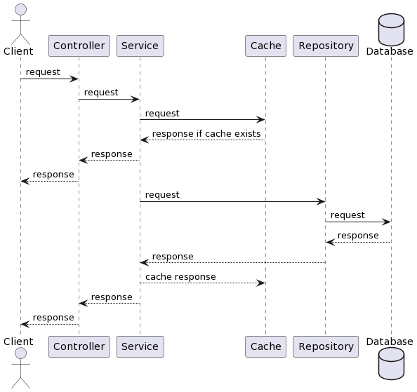
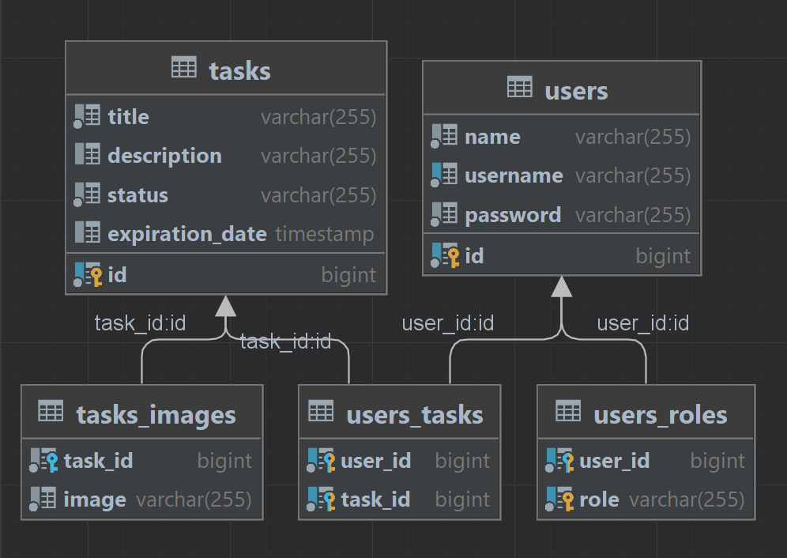

# Tasklist

Это приложение помогает вам организовать создание задач и доступ к ним для пользователей.

Вы можете получить доступ к Swagger и просмотреть все доступные конечные точки, посетив `http://localhost:8080/swagger-ui/index.html`

## Sequence diagram

## Component diagram

Основное приложение взаимодействует с кешем (Redis), базой данных (Postgresql), хранилищем (MinIO).

## Class diagram

В приложении два главных класса - **User** и **Task**.

**User** класс представляет пользователя в этом приложении. Пользователь может входить в систему, создавать и обновлять задачи.

User может иметь роли - `ROLE_USER` или `ROLE_ADMIN`.

**Task** класс представляет задачу в этом приложении. Задачу может создать пользователь.

Task может иметь изображения.

## Environments

Для запуска этого приложения создайте `.env` файл в корневой директории и заполните переменные среды:

- `HOST` - host of Postgresql database
- `POSTGRES_USERNAME` - username for Postgresql database
- `POSTGRES_PASSWORD` - password for Postgresql database
- `POSTGRES_DATABASE` - name of Postgresql database
- `POSTGRES_SCHEMA` - name of Postgresql schema
- `REDIS_HOST` - host of Redis instance
- `REDIS_PASSWORD` - password for Redis
- `JWT_SECRET` - secret string for JWT tokens
- `MINIO_BUCKET` - name of bucket for MinIO
- `MINIO_URL` - URL of MinIO instance
- `MINIO_ACCESS_KEY` - access key of MinIO
- `MINIO_SECRET_KEY` - secret key of MinIO
